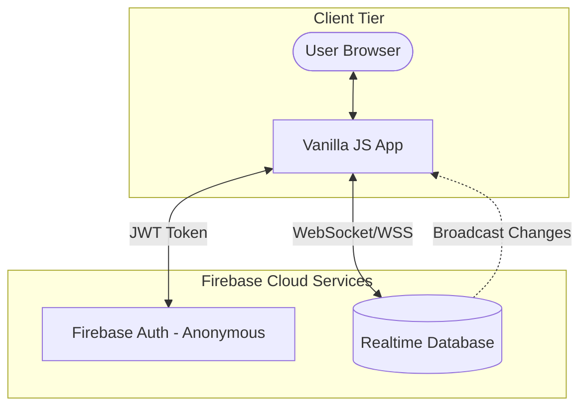
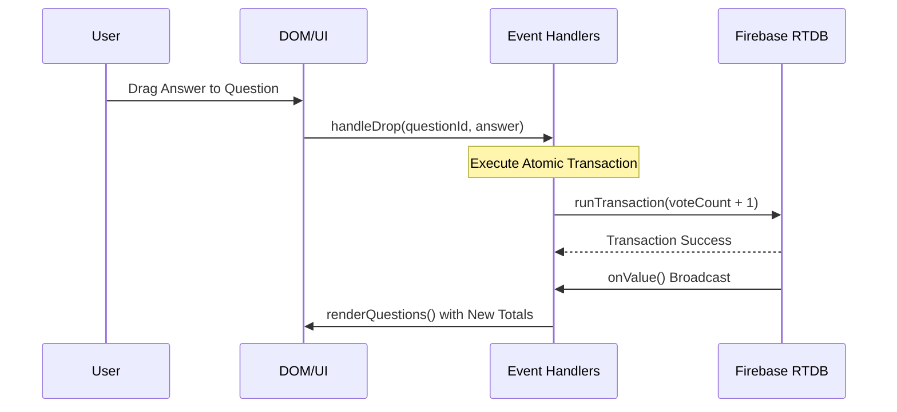

# Scrum Collaboration Board

A real-time collaborative discussion board where team members can drag-and-drop answer cards onto questions to vote. Changes sync instantly across all connected users.

## Features

- **Real-time Collaboration**: Multiple users can participate simultaneously
- **Drag & Drop Voting**: Intuitive answer card dragging
- **Live Vote Counting**: See votes update in real-time
- **Dynamic Questions**: Add/remove questions on the fly
- **Custom Answers**: Add your own answer options

    ## Technical Architecture

### High-Level Design (HLD)
The system follows a **Serverless Real-time Architecture** pattern. The frontend communicates directly with Firebase services for authentication and data persistence, eliminating the need for a custom backend API.



### Low-Level Design (LLD)
The application logic is driven by an **Asynchronous Event-Driven State Machine**. 

#### 1. Data Flow & Synchronization
The app maintains a local `state` object that is kept in "eventual consistency" with the Firebase Realtime Database.



#### 2. Key Components
| Component | Responsibility |
| :--- | :--- |
| `initializeFirebase` | Manages the async loading of the Firebase SDK and initialization of global services. |
| `setupRealtimeSync` | Establishes `onValue` listeners for `answers`, `questions`, and `votes` nodes. |
| `handleDrop` | Coordinates the Drag & Drop API and triggers the atomic vote increment. |
| `renderQuestions` | The primary reconciliation engine that builds the DOM based on the current `state`. |
| `runTransaction` | Ensures data integrity during concurrent voting (Atomic Increment). |

#### 3. Data Schema (Realtime DB)
```json
{
  "rooms": {
    "room_id": {
      "answers": { "key": "Answer Text" },
      "questions": { "key": { "id": 1, "text": "..." } },
      "votes": { "question_id": { "answer_text": 10 } }
    }
  }
}
```

## Setup Instructions

### 1. Firebase Configuration

1. Go to [Firebase Console](https://console.firebase.google.com/)
2. Create a new project (or use existing)
3. Enable **Realtime Database**:
   - Go to "Database" in the left sidebar
   - Click "Create database"
   - Choose "Start in test mode" (you can change security rules later)
4. Get your Firebase config:
   - Go to Project Settings (gear icon)
   - Scroll to "Your apps" section
   - Click "Add app" → Web app (</>)
   - Copy the config object

### 2. Configure the App

1. Open `index.html`
2. The app automatically loads Firebase config in this priority order:
   - `firebase-config.deploy.js` (for production deployment)
   - `firebase-config.local.js` (for local development)
   - Placeholder config (fallback, won't connect to Firebase)

#### For Local Development:
- Copy `firebase-config.sample.js` to `firebase-config.local.js`
- Add your real Firebase config values to `firebase-config.local.js`

#### For Production Deployment:
- Copy `firebase-config.sample.js` to `firebase-config.deploy.js`
- Add your real Firebase config values to `firebase-config.deploy.js`
- **Important**: Never commit `firebase-config.deploy.js` to the repository
- Use build-time injection or manual file placement for deployment

#### Alternative: Build-time Config Injection
For automated deployments, you can inject config during build:
```bash
# Example: Replace placeholders in build script
sed -i 's/YOUR_API_KEY/your-real-api-key/g' index.html
```


### Summary of what we just did:
*   **Branch Protection**: The new workflow allows you to work on `feature/` branches. The "CI" part (`ci-validation`) will run on your feature branch to give you feedback, but the "CD" part (`cd-deployment`) will stay idle.
*   **Separation of Concerns**: Your `deploy.yml` is now a true Pipeline. If the CI fails, the Deployment is automatically cancelled (`needs: ci-validation`).
*   **Documentation**: The README now contains the High-Level Design (HLD), Low-Level Design (LLD), and the CI/CD Pipeline flow.

How does the automated feedback on your branch look in GitHub?

<!--
[PROMPT_SUGGESTION]How can I add a JavaScript linter to the CI job to catch syntax errors automatically?[/PROMPT_SUGGESTION]
[PROMPT_SUGGESTION]Can you explain how to set up Branch Protection Rules in GitHub settings?[/PROMPT_SUGGESTION]
-->
## Development Workflow

To keep the `main` branch stable, we follow a feature-branching strategy:

1. **Create a Feature Branch**: 
   `git checkout -b feature/your-feature-name`
2. **Develop and Commit**: 
   Keep commits small and descriptive.
3. **Push and Open a Pull Request (PR)**: 
   Push your branch to GitHub and open a PR against `main`.
4. **Automated Checks**: 
   GitHub Actions will automatically run validation checks on your PR.
5. **Merge**: 
   Once checks pass, merge the PR into `main` to trigger the automatic deployment to GitHub Pages.

### 3. Deploy to GitHub Pages

1. Create a new GitHub repository
2. Push your code to the repository
3. Go to repository Settings → Pages
4. Set source to "Deploy from a branch"
5. Select "main" branch and "/ (root)" folder
6. Save and wait for deployment

### 4. Share with Team

Share the GitHub Pages URL with your team. Everyone can now collaborate in real-time!

## Security Configuration

### Firebase Security Rules

**CRITICAL**: After setting up Firebase, you MUST configure security rules to prevent unauthorized access.

1. Go to Firebase Console → Realtime Database → Rules
2. Replace the default rules with the contents of `firebase-rules.json`:

```json
{
  "rules": {
    ".read": "auth != null",
    ".write": "auth != null",
    "rooms": {
      "$roomId": {
        ".read": true,
        ".write": "auth != null",
        "answers": {
          ".read": true,
          ".write": "auth != null"
        },
        "questions": {
          ".read": true,
          ".write": "auth != null"
        },
        "votes": {
          ".read": true,
          ".write": "auth != null",
          "$questionId": {
            ".read": true,
            ".write": "auth != null",
            "$answer": {
              ".read": true,
              ".write": "auth != null && newData.val() == (data.val() || 0) + 1",
              ".validate": "newData.isNumber() && newData.val() >= 0 && newData.val() <= 1000"
            }
          }
        }
      }
    }
  }
}
```

### Security Features

- **Anonymous Authentication**: Users are authenticated anonymously to prevent anonymous writes
- **Vote Validation**: Votes can only be incremented by 1, preventing vote manipulation
- **Data Validation**: Vote counts are limited to reasonable ranges (0-1000)
- **Read Access**: Anyone can read data (necessary for collaboration)
- **Write Protection**: Only authenticated users can modify data

### Additional Security Measures

1. **Domain Restriction**: Consider adding domain validation in security rules
2. **Rate Limiting**: Implement rate limiting for vote operations
3. **Data Sanitization**: All user inputs are trimmed and validated
4. **HTTPS Only**: Deploy only on HTTPS (GitHub Pages provides this)
5. **Regular Audits**: Monitor Firebase usage and security events

### Environment Variables

Never commit your Firebase config to version control. Consider using environment variables for production deployments.

### Security Features Implemented

- **Anonymous Authentication**: All users are authenticated before any write operations
- **Input Sanitization**: All user inputs are sanitized to prevent XSS attacks
- **Content Security Policy**: Strict CSP headers prevent unauthorized script execution
- **Vote Validation**: Firebase rules ensure votes can only be incremented by 1
- **Data Validation**: Input length limits and type validation
- **Error Monitoring**: Client-side error logging for security monitoring
- **HTTPS Enforcement**: Deployed on HTTPS-only platform (GitHub Pages)
- **No Search Indexing**: robots.txt prevents search engine crawling

### Security Checklist

- [ ] Firebase project created with proper configuration
- [ ] Security rules deployed (see firebase-rules.json)
- [ ] Anonymous authentication enabled in Firebase Console
- [ ] Domain restrictions configured if needed
- [ ] Regular security audits scheduled
- [ ] Monitor Firebase usage for suspicious activity

### Data Protection

- No personal information is collected or stored
- Anonymous authentication provides session-based access
- All data is encrypted in transit (HTTPS)
- Firebase handles data encryption at rest
- Data retention can be configured in Firebase Console

## Local Development

Open `index.html` directly in your browser for local testing (Firebase config required).

## Browser Support

Works in all modern browsers that support:
- ES6 Modules
- Drag & Drop API
- Firebase SDK
